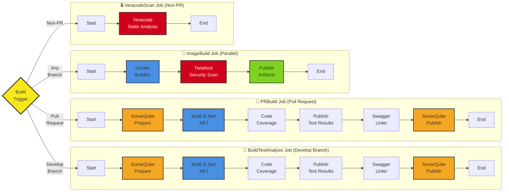
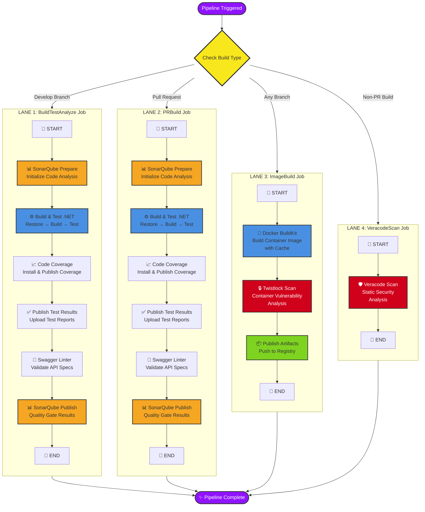

## 1. .NET Application Pipeline

### Version A: Horizontal Layout (Better for wide screens)

```mermaid
graph LR
    Trigger{Build<br/>Trigger}
    
    Trigger -->|Develop<br/>Branch| BTA1
    Trigger -->|Pull<br/>Request| PR1
    Trigger -->|Any<br/>Branch| IMG1
    Trigger -->|Non-PR| VER1
    
    subgraph BuildTestAnalyze["🔨 BuildTestAnalyze Job (Develop Branch)"]
        BTA1[Start] --> BTA2[SonarQube<br/>Prepare]
        BTA2 --> BTA3[Build & Test<br/>.NET]
        BTA3 --> BTA4[Code<br/>Coverage]
        BTA4 --> BTA5[Publish<br/>Test Results]
        BTA5 --> BTA6[Swagger<br/>Linter]
        BTA6 --> BTA7[SonarQube<br/>Publish]
        BTA7 --> BTA8[End]
    end
    
    subgraph PRBuild["📝 PRBuild Job (Pull Request)"]
        PR1[Start] --> PR2[SonarQube<br/>Prepare]
        PR2 --> PR3[Build & Test<br/>.NET]
        PR3 --> PR4[Code<br/>Coverage]
        PR4 --> PR5[Publish<br/>Test Results]
        PR5 --> PR6[Swagger<br/>Linter]
        PR6 --> PR7[SonarQube<br/>Publish]
        PR7 --> PR8[End]
    end
    
    subgraph ImageBuild["🐳 ImageBuild Job (Parallel)"]
        IMG1[Start] --> IMG2[Docker<br/>BuildKit]
        IMG2 --> IMG3[Twistlock<br/>Security Scan]
        IMG3 --> IMG4[Publish<br/>Artifacts]
        IMG4 --> IMG5[End]
    end
    
    subgraph VeracodeScan["🔒 VeracodeScan Job (Non-PR)"]
        VER1[Start] --> VER2[Veracode<br/>Static Analysis]
        VER2 --> VER3[End]
    end
    
    style BTA2 fill:#F5A623,stroke:#333,stroke-width:2px
    style BTA7 fill:#F5A623,stroke:#333,stroke-width:2px
    style PR2 fill:#F5A623,stroke:#333,stroke-width:2px
    style PR7 fill:#F5A623,stroke:#333,stroke-width:2px
    style BTA3 fill:#4A90E2,stroke:#333,stroke-width:2px
    style PR3 fill:#4A90E2,stroke:#333,stroke-width:2px
    style IMG2 fill:#4A90E2,stroke:#333,stroke-width:2px
    style IMG3 fill:#D0021B,stroke:#333,stroke-width:2px,color:#fff
    style VER2 fill:#D0021B,stroke:#333,stroke-width:2px,color:#fff
    style IMG4 fill:#7ED321,stroke:#333,stroke-width:2px
    style Trigger fill:#F8E71C,stroke:#333,stroke-width:3px
```

### Version B: Vertical Swimlane Layout (Better for tall screens)

```mermaid
graph TB
    Start([Pipeline Triggered]) --> Condition{Check Build Type}
    
    Condition -->|Develop Branch| Lane1
    Condition -->|Pull Request| Lane2
    Condition -->|Any Branch| Lane3
    Condition -->|Non-PR Build| Lane4
    
    subgraph Lane1["LANE 1: BuildTestAnalyze Job"]
        direction TB
        L1S[🔨 START]
        L1A[📊 SonarQube Prepare<br/>Initialize Code Analysis]
        L1B[⚙️ Build & Test .NET<br/>Restore → Build → Test]
        L1C[📈 Code Coverage<br/>Install & Publish Coverage]
        L1D[✅ Publish Test Results<br/>Upload Test Reports]
        L1E[📄 Swagger Linter<br/>Validate API Specs]
        L1F[📊 SonarQube Publish<br/>Quality Gate Results]
        L1E1[🏁 END]
        
        L1S --> L1A --> L1B --> L1C --> L1D --> L1E --> L1F --> L1E1
    end
    
    subgraph Lane2["LANE 2: PRBuild Job"]
        direction TB
        L2S[📝 START]
        L2A[📊 SonarQube Prepare<br/>Initialize Code Analysis]
        L2B[⚙️ Build & Test .NET<br/>Restore → Build → Test]
        L2C[📈 Code Coverage<br/>Install & Publish Coverage]
        L2D[✅ Publish Test Results<br/>Upload Test Reports]
        L2E[📄 Swagger Linter<br/>Validate API Specs]
        L2F[📊 SonarQube Publish<br/>Quality Gate Results]
        L2E1[🏁 END]
        
        L2S --> L2A --> L2B --> L2C --> L2D --> L2E --> L2F --> L2E1
    end
    
    subgraph Lane3["LANE 3: ImageBuild Job"]
        direction TB
        L3S[🐳 START]
        L3A[🔨 Docker BuildKit<br/>Build Container Image<br/>with Cache]
        L3B[🔒 Twistlock Scan<br/>Container Vulnerability<br/>Analysis]
        L3C[📦 Publish Artifacts<br/>Push to Registry]
        L3E1[🏁 END]
        
        L3S --> L3A --> L3B --> L3C --> L3E1
    end
    
    subgraph Lane4["LANE 4: VeracodeScan Job"]
        direction TB
        L4S[🔐 START]
        L4A[🛡️ Veracode Scan<br/>Static Security<br/>Analysis]
        L4E1[🏁 END]
        
        L4S --> L4A --> L4E1
    end
    
    Lane1 --> Complete([✨ Pipeline Complete])
    Lane2 --> Complete
    Lane3 --> Complete
    Lane4 --> Complete
    
    style L1A fill:#F5A623,stroke:#333,stroke-width:2px
    style L1F fill:#F5A623,stroke:#333,stroke-width:2px
    style L2A fill:#F5A623,stroke:#333,stroke-width:2px
    style L2F fill:#F5A623,stroke:#333,stroke-width:2px
    style L1B fill:#4A90E2,stroke:#333,stroke-width:2px
    style L2B fill:#4A90E2,stroke:#333,stroke-width:2px
    style L3A fill:#4A90E2,stroke:#333,stroke-width:2px
    style L3B fill:#D0021B,stroke:#333,stroke-width:2px,color:#fff
    style L4A fill:#D0021B,stroke:#333,stroke-width:2px,color:#fff
    style L3C fill:#7ED321,stroke:#333,stroke-width:2px
    style Condition fill:#F8E71C,stroke:#333,stroke-width:3px
    style Start fill:#9013FE,stroke:#333,stroke-width:2px,color:#fff
    style Complete fill:#9013FE,stroke:#333,stroke-width:2px,color:#fff
```