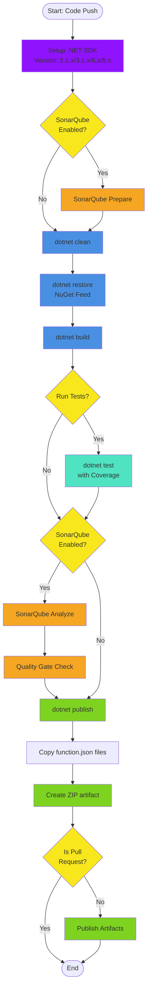

## Function App Pipeline

```mermaid
graph TB
    Start([Start: Code Push]) --> SDK[Setup .NET SDK<br/>Version: 2.1.x/3.1.x/6.x/8.x]
    SDK --> SQ1{SonarQube<br/>Enabled?}
    SQ1 -->|Yes| SQPrep[SonarQube Prepare]
    SQ1 -->|No| Clean
    SQPrep --> Clean[dotnet clean]
    Clean --> Restore[dotnet restore<br/>NuGet Feed]
    Restore --> Build[dotnet build]
    Build --> Test1{Run Tests?}
    Test1 -->|Yes| Test[dotnet test<br/>with Coverage]
    Test1 -->|No| SQ2
    Test --> SQ2{SonarQube<br/>Enabled?}
    SQ2 -->|Yes| SQAnalyze[SonarQube Analyze]
    SQAnalyze --> SQGate[Quality Gate Check]
    SQGate --> Publish
    SQ2 -->|No| Publish[dotnet publish]
    Publish --> Copy[Copy function.json files]
    Copy --> Archive[Create ZIP artifact]
    Archive --> PR{Is Pull<br/>Request?}
    PR -->|No| PubArt[Publish Artifacts]
    PR -->|Yes| End
    PubArt --> End([End])
    
    style SDK fill:#9013FE
    style Clean fill:#4A90E2
    style Restore fill:#4A90E2
    style Build fill:#4A90E2
    style Test fill:#50E3C2
    style SQPrep fill:#F5A623
    style SQAnalyze fill:#F5A623
    style SQGate fill:#F5A623
    style Publish fill:#7ED321
    style Archive fill:#7ED321
    style PubArt fill:#7ED321
    style SQ1 fill:#F8E71C
    style Test1 fill:#F8E71C
    style SQ2 fill:#F8E71C
    style PR fill:#F8E71C
```
