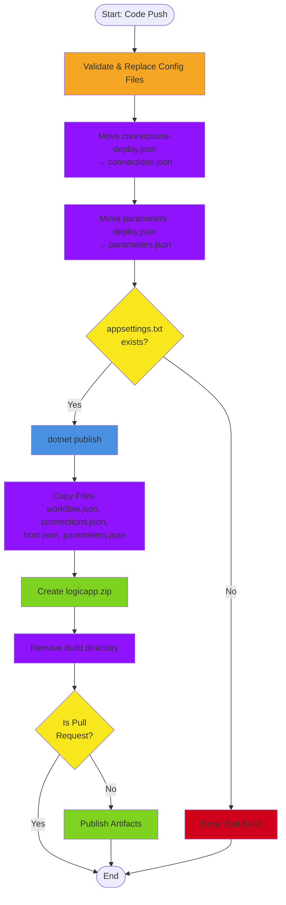

## Logic App Pipeline

```mermaid
graph TB
    Start([Start: Code Push]) --> Validate[Validate & Replace Config Files]
    Validate --> Move1[Move connections-deploy.json<br/>→ connections.json]
    Move1 --> Move2[Move parameters-deploy.json<br/>→ parameters.json]
    Move2 --> Check{appsettings.txt<br/>exists?}
    Check -->|No| Error[Error: Exit Build]
    Check -->|Yes| Publish[dotnet publish]
    Publish --> Copy[Copy Files:<br/>workflow.json, connections.json,<br/>host.json, parameters.json]
    Copy --> Archive[Create logicapp.zip]
    Archive --> Cleanup[Remove build directory]
    Cleanup --> PR{Is Pull<br/>Request?}
    PR -->|No| PubArt[Publish Artifacts]
    PR -->|Yes| End
    PubArt --> End([End])
    Error --> End
    
    style Validate fill:#F5A623
    style Move1 fill:#9013FE
    style Move2 fill:#9013FE
    style Publish fill:#4A90E2
    style Copy fill:#9013FE
    style Archive fill:#7ED321
    style Cleanup fill:#9013FE
    style PubArt fill:#7ED321
    style Error fill:#D0021B
    style Check fill:#F8E71C
    style PR fill:#F8E71C
```
