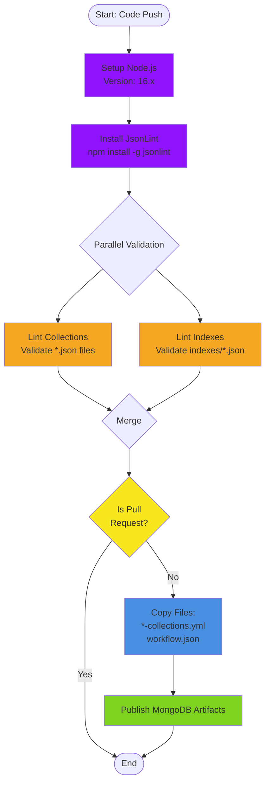

## MongoDB Pipeline

```mermaid
graph TB
    Start([Start: Code Push]) --> Node[Setup Node.js<br/>Version: 16.x]
    Node --> JsonLint[Install JsonLint<br/>npm install -g jsonlint]
    JsonLint --> Fork{Parallel Validation}
    
    Fork --> Collections[Lint Collections<br/>Validate *.json files]
    Fork --> Indexes[Lint Indexes<br/>Validate indexes/*.json]
    
    Collections --> Join{Merge}
    Indexes --> Join
    
    Join --> PR{Is Pull<br/>Request?}
    PR -->|Yes| End([End])
    PR -->|No| Copy[Copy Files:<br/>*-collections.yml<br/>workflow.json]
    Copy --> Publish[Publish MongoDB Artifacts]
    Publish --> End
    
    style Node fill:#9013FE
    style JsonLint fill:#9013FE
    style Collections fill:#F5A623
    style Indexes fill:#F5A623
    style Copy fill:#4A90E2
    style Publish fill:#7ED321
    style PR fill:#F8E71C
```
