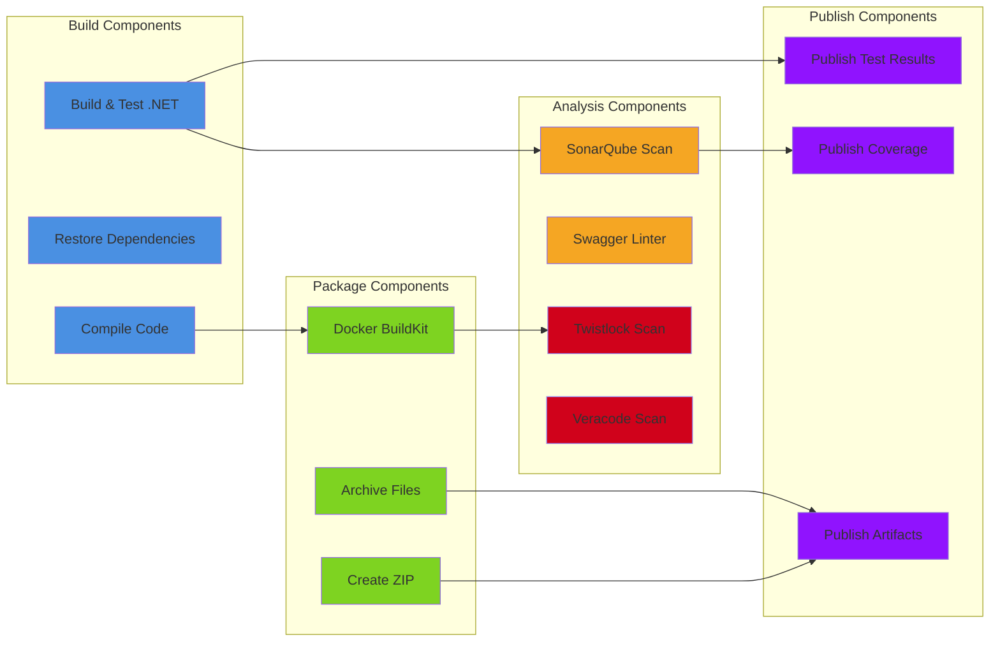

Shared Components Architecture

```mermaid
graph LR
    subgraph "Analysis Components"
        A1[SonarQube Scan]
        A2[Swagger Linter]
        A3[Twistlock Scan]
        A4[Veracode Scan]
    end
    
    subgraph "Build Components"
        B1[Build & Test .NET]
        B2[Restore Dependencies]
        B3[Compile Code]
    end
    
    subgraph "Package Components"
        C1[Docker BuildKit]
        C2[Archive Files]
        C3[Create ZIP]
    end
    
    subgraph "Publish Components"
        D1[Publish Artifacts]
        D2[Publish Coverage]
        D3[Publish Test Results]
    end
    
    B1 --> A1
    B1 --> D3
    B3 --> C1
    C1 --> A3
    C2 --> D1
    C3 --> D1
    A1 --> D2
    
    style A1 fill:#F5A623
    style A2 fill:#F5A623
    style A3 fill:#D0021B
    style A4 fill:#D0021B
    style B1 fill:#4A90E2
    style B2 fill:#4A90E2
    style B3 fill:#4A90E2
    style C1 fill:#7ED321
    style C2 fill:#7ED321
    style C3 fill:#7ED321
    style D1 fill:#9013FE
    style D2 fill:#9013FE
    style D3 fill:#9013FE
```